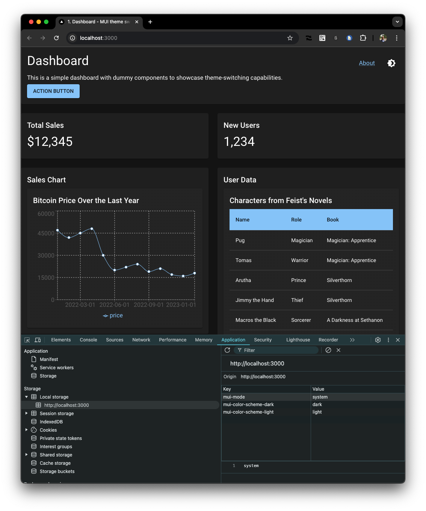
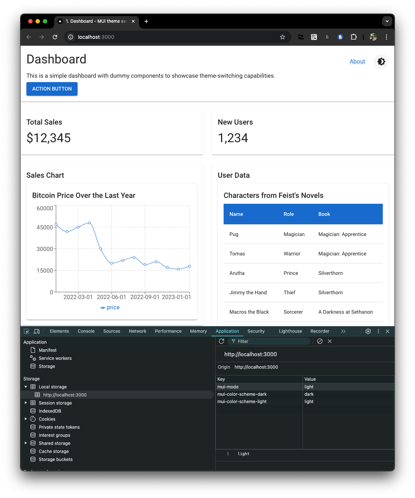
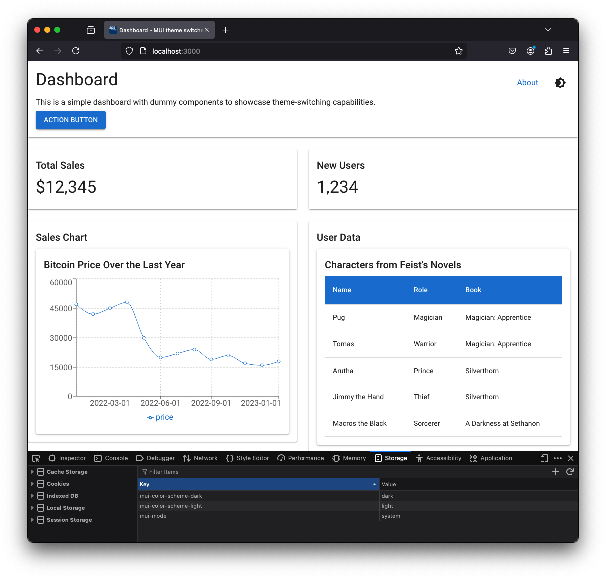

# mui-theme-switcher

This prototype uses either the MUI light theme or the dark theme, based on the preference of the user (via browser or operating system) and uses native MUI functionality only. The user is able to switch between dark and light, it persists accros page changes.

## Demo

<https://stackblitz.com/~/github.com/rkristelijn/mui-theme-switcher>

## Set up

- `npm i` - install dependencies
- `npm run dev` - starts the app
- point to <http://localhost:3000>

## Debug

You can doublecheck what you prefer going to this page and see what your browser supports and what your preference is <https://septatrix.github.io/prefers-color-scheme-test/>

## Architecture


### Concern: loading the theme

The `layout.tsx` file calls for the native `ThemeProvider` from MUI. The theme itself configured to allow the dark mode by default. There is a few things that you are recommended to do:

1. add the `suppressHydrationWarning` to `<html>` This is necessary to prevent mismatched class names during hydration. When using server-side rendering (SSR) with Next.js, the initial HTML is rendered on the server and then hydrated on the client. During this process, there can be mismatches between the server-rendered HTML and the client-rendered HTML, especially when dealing with dynamic themes. Adding suppressHydrationWarning helps to suppress these warnings. More details can be found [here](https://mui.com/material-ui/customization/css-theme-variables/configuration/#next-js-app-router).
2. Initialize Color Scheme: The <InitColorSchemeScript> component from MUI is used to set the initial color scheme based on the user's system preference or a saved preference. This script runs as soon as possible, ensuring that the correct theme is applied immediately. This helps to avoid a flash of unstyled content (FOUC) and provides a seamless user experience when switching between light and dark modes.

### Concern: application 'business as usual'

The page.tsx renders the Dashboard that. There is no concern here for the theme. It is inside of the MUI theme context. Same for the about page.

### Concern: switching the theme.

The `LightDarkSwitch` component checks the current theme mode (`system`, `light`, or `dark`) and renders the appropriate icon. When switching the theme, it updates the theme mode using MUI's useColorScheme hook. The component also respects the user's system preference for dark mode when the mode is set to system.

The theme mode is stored in the browser's local storage by MUI, ensuring that the user's preference is preserved across sessions. This eliminates the need for server-side cookies or redirects to manage the theme state.

The `LightDarkSwitch` component uses the following logic:

- If the current mode is system, it checks the user's system preference and switches to the opposite mode.
- If the current mode is dark or light, it switches to the opposite mode directly.

### Functionality

Initially, when there is no cookie, it renders dark or light theme from [prefers-color-scheme](https://developer.mozilla.org/en-US/docs/Web/CSS/@media/prefers-color-scheme) aka if you prefer light or dark mode.

### Screenshots

Chrome seems to be unable to switch the default without a reboot of the system on mac. Hence a demo for Chrome and Firefox.

<figure>
  
  <figcaption>Chrome settings preference for dark mode</figcaption>
</figure>

<figure>
  
  <figcaption>Chrome showcasing preference for dark mode</figcaption>
</figure>

<figure>
  
  <figcaption>Chrome without any override, defaults to system preference</figcaption>
</figure>

<figure>
  
  <figcaption>Chrome with localstorage, overriding to set light theme</figcaption>
</figure>

<figure>
  
  <figcaption>Firefox prefering light theme</figcaption>
</figure>

<figure>
  
  <figcaption>Firefox without override showing light theme</figcaption>
</figure>

<figure>
  
  <figcaption>Firefox with dark theme override</figcaption>
</figure>

## Set up

To install for yourself from scratch:

### Generate default boilerplate

Start with the MUI/NextJS template. This will have `latest` in the `package.json` as the version so is always up-to-date. However I advice you to pin in to a version if you are going to use it, otherwise it might not work nor build in the near future.

```shell
curl https://codeload.github.com/mui/material-ui/tar.gz/master | tar -xz --strip=2 material-ui-master/examples/material-ui-nextjs-ts
mv material-ui-nextjs-ts mui-theme-switcher
cd mui-theme-switcher
```

### Add some content with one route

I always like to think of every page as a features, this keeps things simple and forces split of concerns in the design.

```shell
src/features/
├── about
│   ├── About.tsx
│   └── components
│       ├── Copyright.tsx
│       ├── ProTip.tsx
│       └── index.ts
└── dashboard
    ├── Dashboard.tsx
    └── components
        ├── Chart.tsx
        ├── DataTable.tsx
        ├── StatsCard.tsx
        └── index.ts
```

This is to emphasise that no special things are needed rather than to use the following principles;

1. All changes to the look and feel (or UI experience) will be done in the theme to ensure consistency
2. Only very local overrides you can do with `sx` property overrides
3. Keep in mind both the dark and light theme if you are going to use overrides when editing colors
