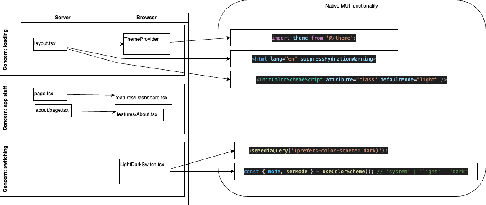
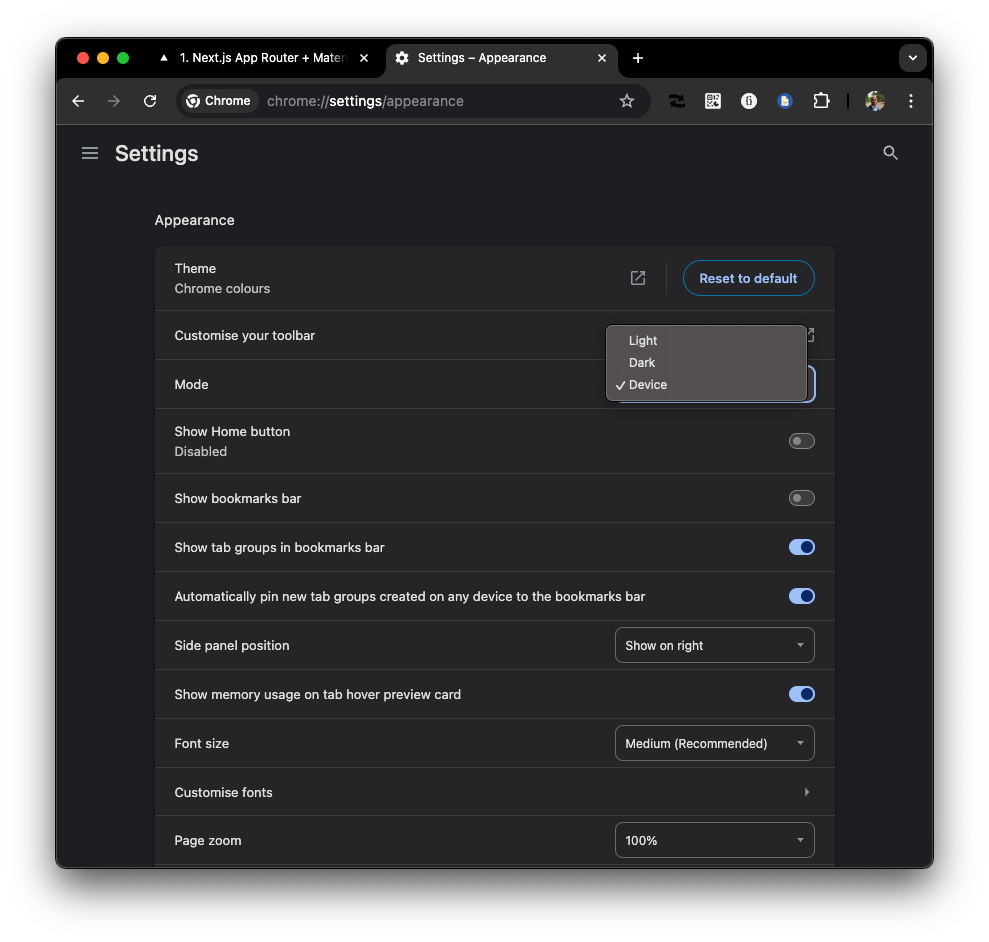
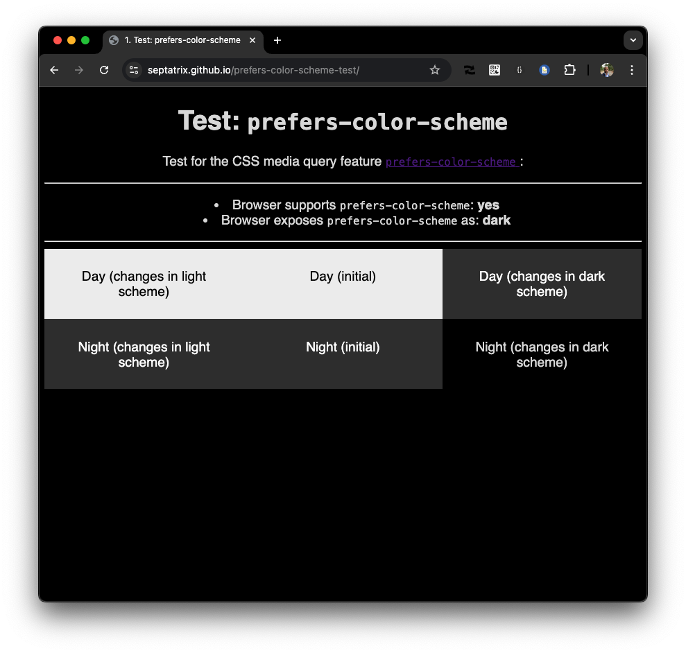
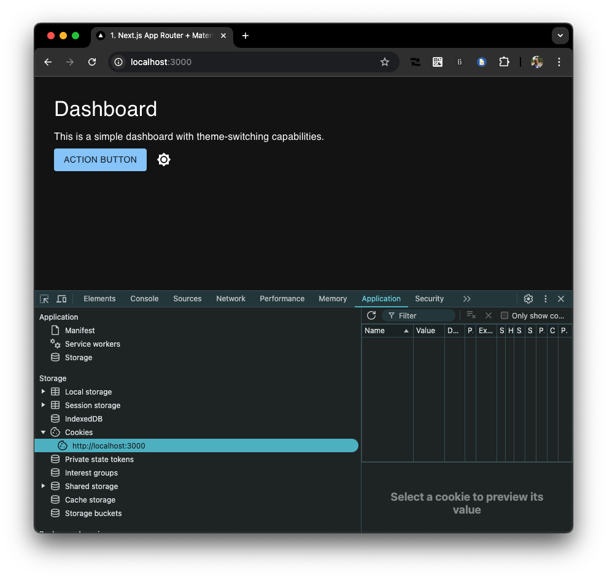
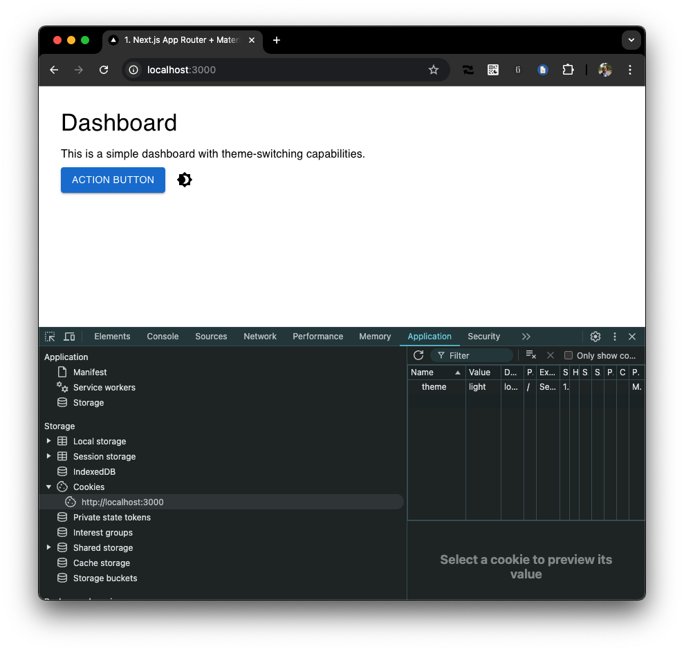
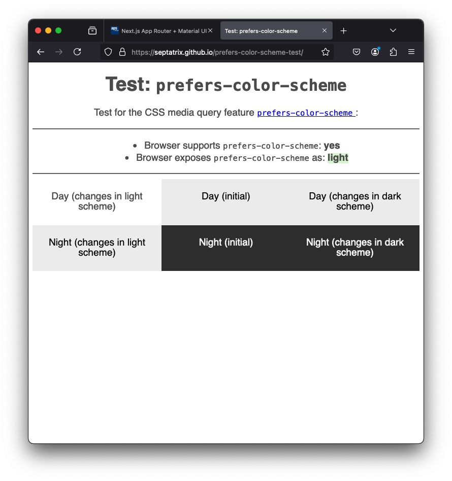
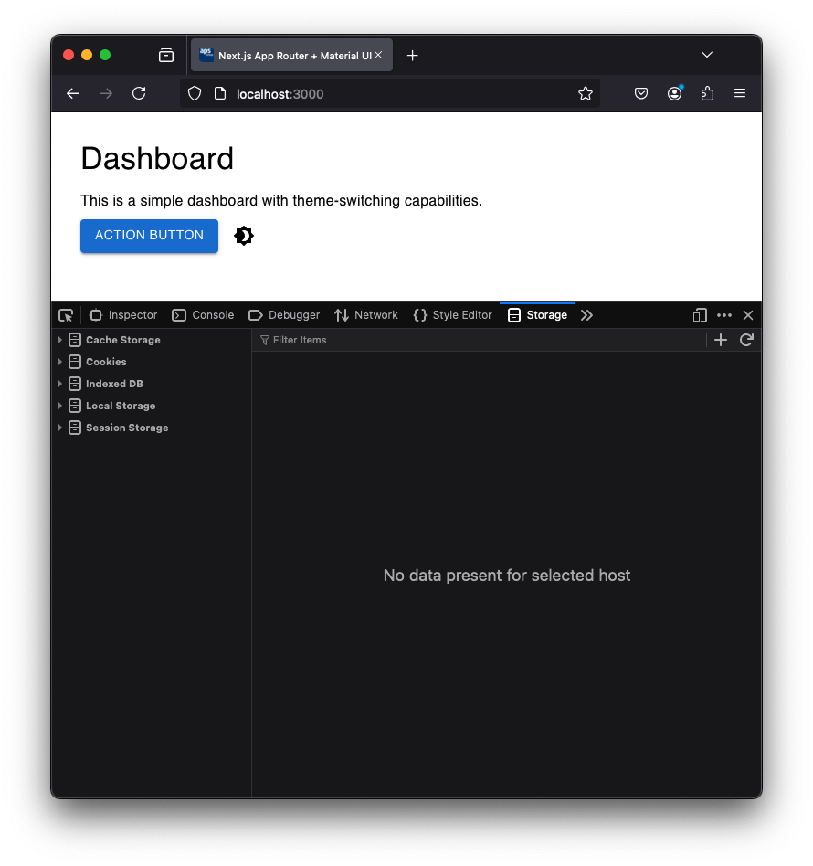
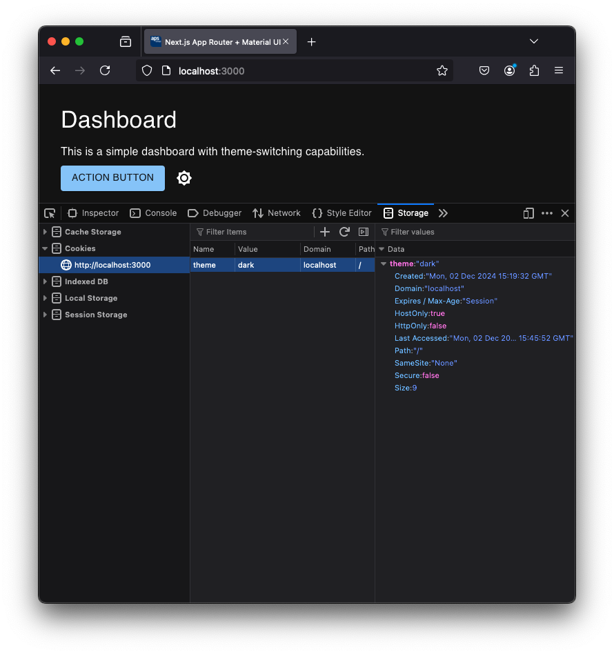

# mui-theme-switcher

This prototype uses either the MUI light theme or the dark theme, based on the preference of the user (via browser) and uses a cookie if the user still wants to deviate from it.

## Set up

- `npm i` - install dependencies
- `npm run dev` - starts the app
- point to <http://localhost:3000>

## Debug

You can doublecheck what you prefer going to this page and see what your browser supports and what your preference is <https://septatrix.github.io/prefers-color-scheme-test/>

## Architecture



### Concern: loading the theme

The `layout.tsx` file calls for the `CustomThemeProvider.tsx` that has some logic and wraps the `MUIThemeProvider`.

### Concern: application 'business as usual'

The page.tsx renders the Dashboard that has

### Concern: switching the theme.

The `LightDarkSwitch` component checks from the theme what is active so that it can render the right icon. When swithing it redirects to `/api/theme?theme=dark` or `/api/theme?theme=light` to set the cookie and redirects to `/` again to clean up the url.

### Functionality

Initially, when there is no cookie, it renders dark or light theme from [prefers-color-scheme](https://developer.mozilla.org/en-US/docs/Web/CSS/@media/prefers-color-scheme) aka if you prefer light or dark mode.

## Demo

<https://stackblitz.com/~/github.com/rkristelijn/mui-theme-switcher>

Chrome seems to be unable to switch the default without a reboot of the system on mac. Hence a demo for Chrome and Firefox.

<figure>
  
  <figcaption>Chrome settings preference for dark mode</figcaption>
</figure>

<figure>
  
  <figcaption>Chrome showcasing preference for dark mode</figcaption>
</figure>

<figure>
  
  <figcaption>Chrome without cookie, defaults to system preference</figcaption>
</figure>

<figure>
  
  <figcaption>Chrome with cookie, overriding to set light theme</figcaption>
</figure>

<figure>
  
  <figcaption>Firefox prefering light theme</figcaption>
</figure>

<figure>
  
  <figcaption>Firefox without any cookie showing light theme</figcaption>
</figure>

<figure>
  
  <figcaption>Firefox wit cookie showing dark theme</figcaption>
</figure>

## Set up

To install for yourself from scratch:

```shell
curl https://codeload.github.com/mui/material-ui/tar.gz/master | tar -xz --strip=2 material-ui-master/examples/material-ui-nextjs-ts
mv material-ui-nextjs-ts mui-theme-switcher
cd mui-theme-switcher
```

Apply:

- api/theme/route.ts to set the cookie
- wrap the MUIThemeProvider
  etc
